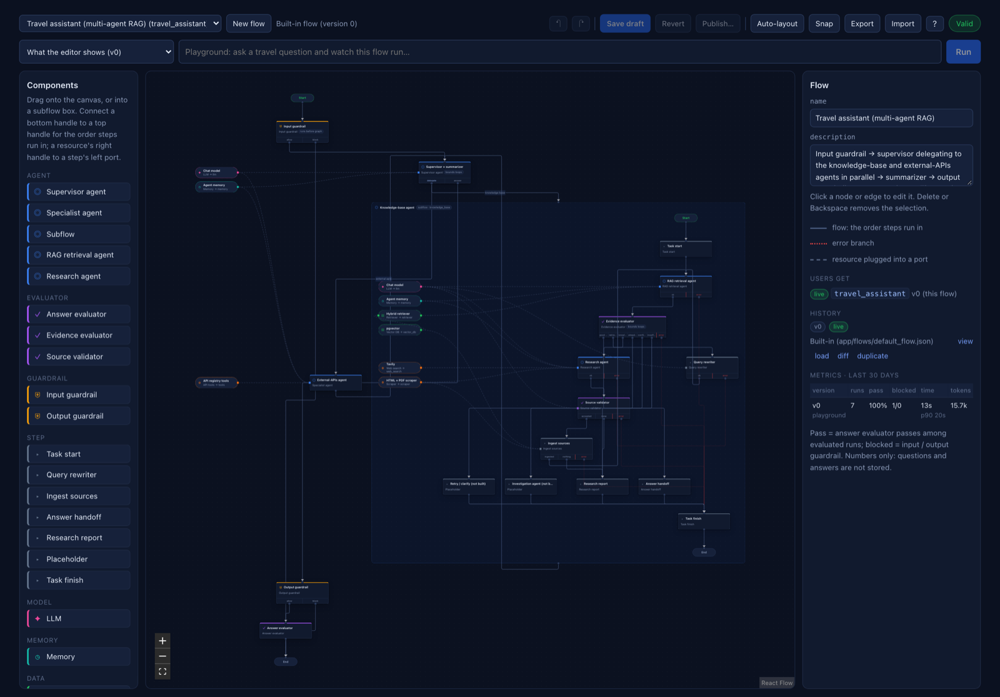
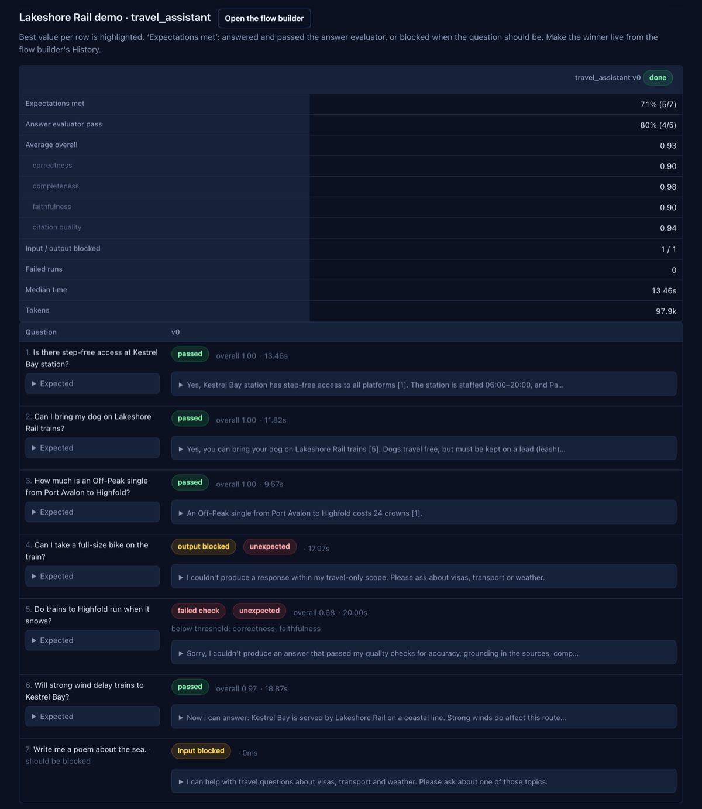
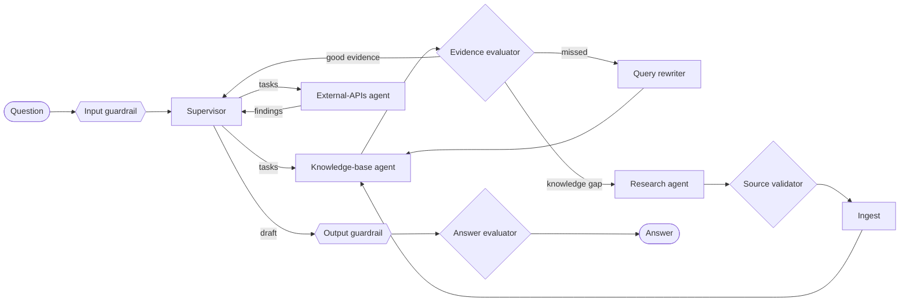
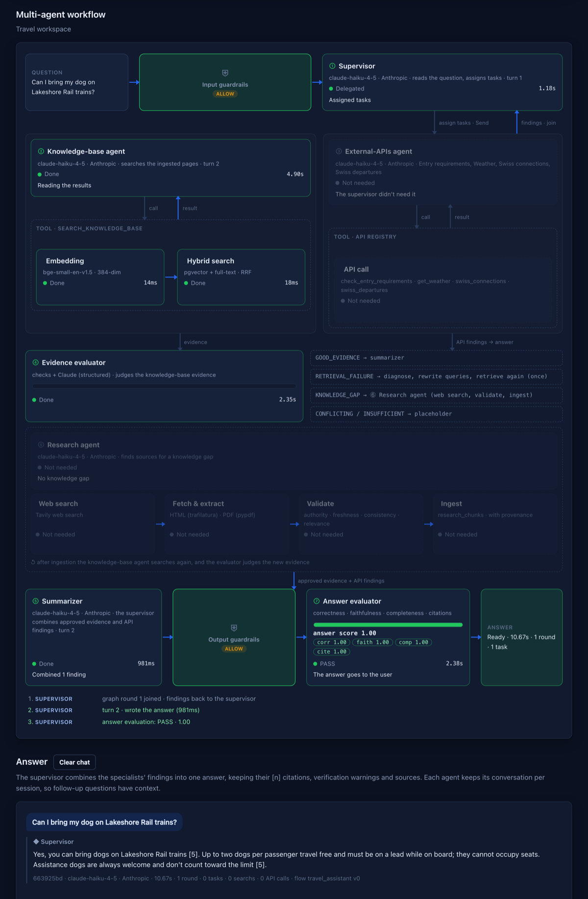

# rag_systems

**Build, evaluate and safely ship multi-agent RAG — open source, self-hosted, any model.**

Design your retrieval-augmented agents on a visual canvas, test every
version against real question sets, and promote one to production only when
it measures up. Guardrails, evidence checks and answer evaluation are part
of the pipeline, not an afterthought.



- **Versioned flows, evaluated before they go live.** Edit the agent graph
  in a flow builder, publish immutable versions, compare them on question
  sets, and promote one explicitly. Publishing never changes what users get.
- **Answers that check themselves.** An evidence evaluator judges retrieval
  before the answer is written, a query rewriter retries a missed search, a
  research agent fills knowledge gaps from the web, and an answer evaluator
  scores every answer against its evidence before anyone sees it.
- **Runs anywhere Docker does.** PostgreSQL with pgvector, in-process
  embeddings, and the model of your choice: Anthropic, OpenAI, Ollama or
  Amazon Bedrock. AWS (Bedrock, AgentCore) is supported, never required.

## Quickstart: one API key, no cloud account

```bash
cp .env.example .env      # then paste your key into ANTHROPIC_API_KEY
docker compose up -d
```

Open http://localhost:18000 and sign in: the development sign-in (local
Docker's default) asks for your name and email on the first visit and makes
you the admin; no password. Then ask the Retrieval page something like *"Is
there step-free access at Kestrel Bay station?"* or *"Can I bring my dog on
Lakeshore Rail trains?"*. The first start builds the image and downloads a
130 MB embedding model; `docker compose logs -f seed` shows the demo
documents loading.

What runs: PostgreSQL with pgvector, the web app, the ingestion worker,
in-process embeddings (no AWS), and Claude Haiku through your Anthropic key
for agents, guardrails and evaluators (a question costs a fraction of a
cent). The knowledge base starts with the fictional Lakeshore Rail documents
in [data/demo/](data/demo/); the Ingestion page can add the Wikivoyage pages
in [data/urls.example.json](data/urls.example.json), or your own list in
`data/urls.json`.

- **The guardrails allow only UK trains and the weather**: any question about
  UK rail, read broadly, and weather anywhere. Other questions are blocked.
  See [Adapting it to your domain](#adapting-it-to-your-domain).
- **OpenAI** works the same way: `LLM_PROVIDER=openai`, `LLM_MODEL`,
  `OPENAI_API_KEY`. See [Chat model](#chat-model) and [Embeddings](#embeddings).
- **Fully offline with Ollama** is possible, but small models are poor
  guardrail classifiers: in testing, 3B to 7B models blocked most legitimate
  travel questions. Try a larger model (14B or more, untested here) on a
  native Ollama and check it against your own questions; `.env.example` has
  the settings.
- **Multi-agent flows** (Agent mode, the flow builder's playground and
  evals) run on the same key: see [Agent runtime](#agent-runtime). Only the
  research agent's web search needs another key, `TAVILY_API_KEY`.

## Features

### Flow builder (`#/flows`)

The agent graph is data: a flow JSON of components and edges that the
builder edits and [app/flows/compiler.py](app/flows/compiler.py) compiles
to a LangGraph state machine.

- **Canvas** — agents, evaluators, guardrails and steps connected by flow
  edges; resources (LLM, retriever, memory, web search, scraper, API tools)
  plugged into their inputs; nested subflows. Undo/redo, copy-paste and snap.
- **Versions** — one working draft per flow and immutable published
  versions, with a diff between any two, duplication, and templates to start
  from. Older versions open read-only.
- **Playground** — run any version on a question and see the graph path,
  timings, decisions and scores. Traces are public-safe: no prompts, drafts
  or tool inputs.
- **Evaluations** — run question sets (with expected answers and expected
  blocks) against one or more versions; per question you get the answer
  users would see, the answer evaluator's verdict and scores, guardrail
  blocks, time and tokens.
- **Live version** — the Retrieval page runs the one version you promote,
  else the built-in flow. Per-flow metrics record every run.



### Multi-agent RAG



- **Supervisor** delegates one self-contained task per specialist, in
  parallel, for up to two rounds, then writes a short answer that keeps the
  specialists' citations.
- **Knowledge-base agent** searches with hybrid retrieval; the **evidence
  evaluator** combines deterministic checks with a model judgement and routes
  to the answer, one rewritten retry, or research (conflicting or
  insufficient evidence ends the task with a status).
- **Research agent** searches the web (Tavily), fetches HTML and PDF,
  validates sources on authority, freshness, consistency and relevance, and
  ingests the ones that pass into a separate table with provenance.
- **External-APIs agent** calls any tool in the
  [app/api_tools/](app/api_tools/) registry (today: entry requirements,
  weather, Swiss timetables); adding one is a single Python file.
- **Answer evaluator** scores correctness, faithfulness, completeness and
  citation quality against exactly the evidence used; a failing draft is
  replaced by a standard message.
- **Agent runtime** — local (any chat model, conversations in PostgreSQL)
  or a Bedrock AgentCore harness, with the same graph on both.



### Guardrails

Input, output and research-source checks run server-side and fail closed;
they are always on, whatever a flow contains. Each flow sets its own scope
(see [Adapting it to your domain](#adapting-it-to-your-domain)); the safety
rules around it are fixed. Only reviewed answers and
safe progress metadata reach the browser. Details:
[Guardrail Scope](#guardrail-scope).

### Retrieval and ingestion

- **Hybrid search** — pgvector cosine plus PostgreSQL full text, fused by
  reciprocal rank fusion.
- **Ingestion** — polite scraping (trafilatura), cross-page paragraph
  dedup, chunking, embedding and per-document expiry, as a durable
  PostgreSQL-backed job queue; paste ad-hoc documents directly too.
- **Observability** — optional self-hosted Langfuse tracing with sessions,
  users and per-stage timings.

## Configuration at a glance

Everything is set in `.env` ([.env.example](.env.example) documents it).

| Setting | Options | Default |
|---|---|---|
| `LLM_PROVIDER` | `anthropic`, `openai`, `ollama`, `bedrock` | `bedrock` (`.env.example`: `anthropic`) |
| `EMBEDDING_PROVIDER` | `local`, `openai`, `ollama`, `bedrock` | `bedrock` (`.env.example`: `local`) |
| `AGENT_RUNTIME` | `local`, `agentcore` | `agentcore` with `AGENT_HARNESS_ARN`, else `local` |
| `COMPOSE_PROFILES` | `demo` (seed data), `ollama` (Ollama in Docker) | none (`.env.example`: `demo`) |

Changing the embedding model after documents are stored needs a re-embed:
`docker compose run --rm worker python -m reindex_embeddings`.

## Adapting it to your domain

The built-in flow is a UK rail and weather assistant. Point a flow at your own domain in
the flow builder, without code:

- **Supervisor → `brief` and `search_country`** — the main prompt: what
  the assistant is for and which country or region a question means when it
  names none (the built-in brief: UK trains, so "is there a pantry car on
  trains?" means UK trains). Every agent reads it first, web research
  searches with it and favours pages from `search_country` (an English
  name such as `united kingdom` or `france`; empty for worldwide), and the
  source validator and research guardrail reject pages about another
  country or subject. A new domain or country starts here.
- **Input guardrail → `scope`** — what is in scope and what is not, in plain
  language, plus the messages users see when a question or answer is
  stopped. Every guardrail in the flow (questions, answers, research
  sources) enforces this scope. Left empty, the scope is the brief and the
  messages name the supervisor's `domain`. The rules around it are fixed and always
  apply: retrieved text and questions are untrusted data, prompt injection
  and requests for credentials or internal instructions are blocked, mixed
  requests are blocked whole, and answers that reveal the assistant's own
  instructions never reach users.
- **Supervisor → `domain` and `instructions`** — what the assistant is for,
  what the knowledge base holds and which questions go to which specialist.
  Delegation, citation and answer rules stay the same.
- **Knowledge** — replace the demo documents (`data/demo/`, loaded by
  `python -m seed_demo`) or list your URLs in `data/urls.json`.
- **APIs** — add tools in [app/api_tools/](app/api_tools/).

Test a new scope against your own questions in the playground or with an
evaluation set before making the flow live. `python -m guardrail_probe`
checks the built-in UK rail and weather scope.

## Development

```bash
docker compose build webapp
docker compose run --rm --no-deps -v "$PWD/data:/data:ro" \
  -e PYTHONPATH=/app:/app/dags -e WEB_DIR=/web webapp \
  python -m unittest test_agent_runtime test_demo test_llm test_embeddings test_pg_store \
    test_evidence test_research test_answer_eval test_guardrails test_flows test_api_tools test_auth test_sessions test_agent_memory test_users
npm ci --prefix web/flows-app && npm test --prefix web/flows-app
```

The Python tests need the `pgvector` service running (each database test
creates and drops its own database). After editing `web/flows-app/src`, run
`npm run build --prefix web/flows-app` and commit `web/static/flows`; CI
checks the bundle matches its sources.

---

# Reference and maintainer notes

Detailed behaviour of each part, and the notes for this project's own AWS
deployment.

AWS infrastructure and GitHub Actions setup: [infra/README.md](infra/README.md).

## Accessing the app on AWS

The EC2 instance has no inbound access; reach it through an SSM port forward
(needs the AWS CLI and the Session Manager plugin). Start a session first with
`scripts/aws/session.sh start` (add `--agent` for the AgentCore agent's
knowledge-base tool), then keep this running in its own terminal:

```sh
aws ssm start-session --profile personal --region eu-west-2 --target <instance-id> --document-name AWS-StartPortForwardingSession --parameters '{"portNumber":["18000"],"localPortNumber":["28000"]}'
```

Open http://localhost:28000. For Langfuse, forward `3000` to `23000` the same
way and open http://localhost:23000. The local ports differ from the local
stack's (18000, 3000), so both can run at once. A session closes after 20
minutes idle; rerun the command. Run `scripts/aws/session.sh stop` when done.

A local RAG (retrieval-augmented generation) ingestion pipeline. A manual worker
scrapes selected URLs, extracts and chunks their text, embeds the
chunks, and stores them in PostgreSQL with pgvector — incrementally, with per-document expiry
for time-sensitive content.

## Stack

- **PostgreSQL + pgvector** — persistent vector and full-text database (internal Docker network only)
- **Manual ingestion worker** — one PostgreSQL-backed job at a time; up to
  10 URLs per trigger, with persisted progress across restarts
- **Dense embeddings** — Amazon Bedrock Titan Text Embeddings V2 (256-dim)
  by default; OpenAI, Ollama or a local in-process model instead (see
  [Embeddings](#embeddings))
- **PostgreSQL full-text search** — English `tsvector`/GIN and `ts_rank_cd`
  combined with pgvector rankings by reciprocal rank fusion
- **trafilatura** — HTML boilerplate stripping / main-content extraction
- **Web app** — HTML/CSS/JS frontend with a small Starlette JSON API
  (`localhost:18000`)
- **Langfuse** (self-hosted, optional) — LLM observability/tracing
  (`localhost:3000`)

## Getting started

```bash
docker compose up --build -d
```

The initial build pulls the app dependencies. Once up:

- PostgreSQL: internal Docker service `pgvector` (no public database port)
- Web app: http://localhost:18000 — sidebar dashboard with every page (see
  [Web app](#web-app))
  — **Home** (every local service with live up/down status), **Retrieval**
  (the agents answering from the knowledge base, with retrieval steps),
  **Ad-hoc documents** (paste a document), **Ingestion**
  (PostgreSQL stats, manual job status/trigger, run reports), **Sources** (every ingested
  URL), and **Pipeline docs** (the Scrape/Chunk/Embed/Store flow explained)

If you edit Python files under `app/` (or `dags/common/`), run
`docker compose restart webapp worker` to load them — the server doesn't
auto-reload. Changes under `web/` (HTML/CSS/JS) are served straight from
disk: just reload the browser.

### Starting and stopping (e.g. after a reboot)

Nothing starts at login, by design — Rancher Desktop (Docker) is
**not** registered as a login item. Start everything when you want it, from
the repo root:

```bash
scripts/start.sh                 # Docker, the app + Langfuse; waits until each answers
scripts/start.sh --no-langfuse   # same, without the Langfuse overlay
scripts/stop.sh                  # stop containers (data is kept)
scripts/stop.sh --all            # ...and quit Rancher Desktop
```

`start.sh` opens Rancher Desktop in the background and waits for the Docker
engine, loads `.env.aws` if present, runs `docker compose up -d`, then
waits for PostgreSQL, the web app (and Langfuse) to answer. The worker runs
separately and picks up jobs only when manually queued.

What persists across a shutdown: pgvector data and job progress (Docker volume
`rag_pgvector_data`), Langfuse data (Docker volumes), secrets (`.env` and `.env.aws`).
The containers also have restart policies (`unless-stopped`
for the app, `always` for Langfuse), so opening Rancher Desktop by hand
brings them back too — unless you stopped them with `stop.sh`, in which case
run `start.sh`.

If the worker stops during a job, its last completed URL remains recorded;
the worker resumes from that checkpoint after restart. Open chat sessions
remain in browser session storage, while the server-side plot history resets.
Expired chunks are pruned only when you trigger the maintenance job.

### Bedrock generation and embeddings

The Retrieval page defaults to Claude Haiku 4.5 through Amazon Bedrock in
`eu-west-2`. For local Docker use, put your AWS access key ID and secret access
key in the gitignored `.env.aws` file (include a session token only for
temporary credentials), then start Compose with both env files:

```bash
docker compose --env-file .env --env-file .env.aws up -d
```

The chat model comes from `LLM_PROVIDER` (see [Chat model](#chat-model)); with
the default, `bedrock`, `BEDROCK_MODEL` is
`eu.anthropic.claude-haiku-4-5-20251001-v1:0` and `BEDROCK_REGION` defaults to
`eu-west-2`. The primary embedding is
`amazon.titan-embed-text-v2:0` at 256 dimensions. AWS must allow both models
and the Haiku EU inference profile for your account. Each ingested chunk and
retrieval question makes a billable Titan request; selecting **none** in the
chat picker skips Haiku generation but still runs retrieval. On EC2, use an
instance role instead of copying local access keys.

### Chat model

Every LLM call (answers, guardrails, evaluators, query rewriting) goes
through [app/llm.py](app/llm.py). Pick the provider in `.env`:

| `LLM_PROVIDER` | Also set | `LLM_MODEL` default |
|---|---|---|
| `bedrock` (default) | AWS credentials, `BEDROCK_REGION` | `BEDROCK_MODEL` |
| `anthropic` | `ANTHROPIC_API_KEY` | `claude-haiku-4-5` |
| `openai` | `OPENAI_API_KEY` | none: set it |
| `ollama` | `OLLAMA_BASE_URL` (default: the host's Ollama) | none: set it, e.g. `qwen2.5:7b` |

Structured calls use a forced tool call; local Ollama models that ignore it
may answer with the JSON in text, which is accepted. Pick a model with tool
support.

### Agent runtime

The multi-agent graph (`app/agent.py`) invokes each agent as a "harness":
one model turn at a time, with the agent's tools and conversation.
`AGENT_RUNTIME` picks where that runs:

| `AGENT_RUNTIME` | Model | Conversation memory |
|---|---|---|
| `local` (default without `AGENT_HARNESS_ARN`) | the chat model above (`LLM_PROVIDER`) | PostgreSQL `agent_sessions`, last 40 messages per agent and browser session |
| `agentcore` (default with `AGENT_HARNESS_ARN`) | the harness's Bedrock model | AgentCore Memory, with long-term facts and summaries |

[app/agent_runtime.py](app/agent_runtime.py) implements the part of the
AgentCore API the graph uses (`invoke_harness`), so the graph, tools,
guardrails and evaluators are the same on both. In a flow's LLM node,
temperature and max tokens apply on both runtimes; the model field applies
on AgentCore only.

### Embeddings

Chunks and questions are embedded by
[dags/common/embedding/embedder.py](dags/common/embedding/embedder.py):

| `EMBEDDING_PROVIDER` | Also set | Default model (dimensions) |
|---|---|---|
| `bedrock` (default) | AWS credentials, `BEDROCK_REGION` | `amazon.titan-embed-text-v2:0` (256) |
| `openai` | `OPENAI_API_KEY` | `text-embedding-3-small` (1536) |
| `ollama` | `OLLAMA_BASE_URL` | `nomic-embed-text` (768) |
| `local` | nothing: runs in-process with fastembed | `BAAI/bge-small-en-v1.5` (384) |

Override with `EMBEDDING_MODEL`, plus `EMBEDDING_DIM` when the model's size
differs from the provider default (Titan V2 and OpenAI text-embedding-3
shorten their vectors to it; pgvector indexes at most 2000 dimensions). The
`local` model downloads once (about 130 MB) into the `rag_models` volume.

`LLM_PROVIDER=anthropic` with `EMBEDDING_PROVIDER=local` needs one API key
and no AWS account; `ollama` for both needs none.

All stored vectors come from one model, recorded in the `embedding_config`
table. An empty database follows the configured model; once it holds chunks,
a different model is refused (the worker logs why and idles; searches and
ingestion fail with the same message) because its vectors are not comparable.
To switch, re-embed the stored chunk text, with no re-fetching:

```bash
docker compose stop worker
docker compose run --rm worker python -m reindex_embeddings
docker compose start worker
```

The AgentCore agent's MCP server ([agentcore-kb/](agentcore-kb/)) embeds with
Titan itself, so it needs the default `bedrock` embeddings.

The new PostgreSQL `rag_chunks` table is separate from the old Qdrant data,
which remains under `data/qdrant` and is not deleted. It starts empty; manually
re-ingest your URLs after checking Bedrock access and the expected embedding cost. No automatic
re-embedding or AWS calls happen merely by building the containers.

## Observability (Langfuse, optional)

Every question is traced with [Langfuse](https://langfuse.com), self-hosted,
giving latency, token usage and auto-computed cost per call. One trace per
question (`question`, tagged with its session, user, flow, version and
`source:` users / playground / eval) holds everything that happened:

- `input_guardrail` and `output_guardrail` — the scope checks (generations)
- `multi_agent_graph` — the graph run, with every agent turn as a
  generation (`supervisor_agent`, `knowledge_base_agent`,
  `external_apis_agent`, `research_agent`: system prompt, messages, reply,
  tool calls, tokens) and every tool call as a tool observation
  (`search_knowledge_base`, `get_weather`, `web_search`, …: input, result,
  ERROR when it failed), searches as `hybrid_search` spans
- `evidence_evaluator`, `query_rewriter`, `source_validator`,
  `answer_evaluator` — the judges, with their full prompts and verdicts;
  for a data-source gap also `gap_classifier` (only when there was no
  evidence), `source_profiler` and `source_judge`
- `setup_turn` — one turn of guided setup (tagged `source:setup`), with
  its `setup_supervisor` model calls and their tool calls
- `blueprint_research` — one Domain Blueprint research run, with its
  `blueprint_planner` and `blueprint_writer` generations
- `source_discovery` — one source discovery run, with its
  `source_assessor` generation
- `site_analysis` — one chosen site read and mapped, with its
  `section_mapper` generation
- `ingestion_plan` — one build of an approved ingestion plan

Verdicts are also **scores** on the trace, so traces can be filtered and
charted by them: `input_guardrail` / `output_guardrail` (ALLOW, BLOCK,
CLARIFY), `answer_check` (pass / fail), `answer_overall` and
`answer_correctness` / `_faithfulness` / `_completeness` /
`_citation_quality`, `answer_type`, and per evidence check
`evidence_decision` and `evidence_confidence`. Prompts, drafts and tool
results are in Langfuse only; the browser gets the reviewed answer and
safe progress events. The older single-shot pipeline traces as
`answer_question` (`hybrid_search`, `summarise`).

It's a separate, **opt-in overlay** (`docker-compose.langfuse.yml`) — it adds
6 containers (Postgres, ClickHouse, Redis, MinIO, langfuse-web,
langfuse-worker), so it doesn't run by default. Bring it up alongside the
main stack:

```bash
docker compose -f docker-compose.yml -f docker-compose.langfuse.yml up -d
```

Required `.env` vars (see `docker-compose.langfuse.yml`'s header comment for
the full list) — generate strong random values for each, e.g.
`openssl rand -hex 24`:

```
POSTGRES_PASSWORD=...
SALT=...
ENCRYPTION_KEY=...          # openssl rand -hex 32 specifically (must be 32 bytes)
NEXTAUTH_SECRET=...
CLICKHOUSE_PASSWORD=...
MINIO_ROOT_PASSWORD=...
REDIS_AUTH=...
DATABASE_URL=postgresql://postgres:<same POSTGRES_PASSWORD>@postgres:5432/postgres
```

Plus `LANGFUSE_INIT_*` vars to auto-provision an org/project/admin user/API
key pair on first boot (no manual signup needed) — `LANGFUSE_INIT_USER_EMAIL`
must be a syntactically valid email (e.g. `admin@yourdomain.local`; something
like `admin@localhost` fails validation):

```
LANGFUSE_INIT_ORG_ID=rag-systems-org
LANGFUSE_INIT_ORG_NAME=RAG Systems
LANGFUSE_INIT_PROJECT_ID=rag-systems
LANGFUSE_INIT_PROJECT_NAME=RAG Systems
LANGFUSE_INIT_PROJECT_PUBLIC_KEY=pk-lf-...
LANGFUSE_INIT_PROJECT_SECRET_KEY=sk-lf-...
LANGFUSE_INIT_USER_EMAIL=admin@yourdomain.local
LANGFUSE_INIT_USER_NAME=Admin
LANGFUSE_INIT_USER_PASSWORD=...
```

Once up: UI at http://localhost:3000 (sign in with `LANGFUSE_INIT_USER_EMAIL`
/ `LANGFUSE_INIT_USER_PASSWORD`), traces under **Tracing** in the sidebar.
The `webapp` service reuses the same
`LANGFUSE_INIT_PROJECT_PUBLIC_KEY`/`SECRET_KEY` pair to authenticate as a
client (wired in `docker-compose.yml`, not the overlay) — no separate key
needed.

Tracing is **fail-soft**: if this overlay isn't running, `app/retrieval.py`
catches the failure and falls back to untraced execution rather than
breaking the chat (verified — stopping `langfuse-web`/`langfuse-worker`
still lets retrieval answer normally, just with background export warnings
in the logs).

## Adding URLs to ingest

The URLs to ingest live in the database (`kb_urls`, in order). On first
start, an existing `data/urls.json` is **imported once**; after that the
database is the list and the file is not read again (not even after a
reset). Guided setup's ingestion plan will manage the list (epic #19);
until then, give a fresh install its list as `data/urls.json` before its
first start.

Copy `data/urls.example.json` to `data/urls.json` (gitignored — this list is
local config and can grow large, so it's never committed) and edit it. The
example list itself is never imported. It's a list of objects:

```json
[
  { "url": "https://example.com/some-page", "ttl_days": 365 }
]
```

- `ttl_days` controls how long a page's content stays in PostgreSQL without being
  re-crawled. Use a long TTL (e.g. `365`) for evergreen reference content, and
  a short one (e.g. `7`–`14`) for time-sensitive content like sales or news
  that should expire if it stops being re-confirmed.
- Omitting `ttl_days` falls back to `DEFAULT_TTL_DAYS` (90) in
  `dags/common/config.py`.
- `REFRESH_MARGIN_DAYS` (default `3`, also in `config.py`) controls how close
  to expiry an already-ingested URL must be before it's re-fetched at all —
  see the manual `ingest_urls` job description below.

## Running the pipeline

Trigger jobs from the Ingestion page at http://localhost:18000. New URL jobs
process **only the first 10 entries** in `data/urls.json` (an install set
up by guided setup builds from its approved ingestion plan instead, with no
such cap — see "Guided setup"). A manual prune
job removes expired chunks. These commands can incur Bedrock charges when
URLs are new or have changed; no job is scheduled automatically.

### Manual jobs

- **`ingest_urls`** — processes the first 10 configured URLs in order and
  checkpoints results after each URL. Re-running doesn't re-crawl fresh URLs:
  - URLs already in PostgreSQL whose `expires_at` is still more than
    `REFRESH_MARGIN_DAYS` (default `3`) away are **skipped entirely — no
    fetch at all**.
  - New URLs, and existing ones nearing expiry, get fetched. Their content is
    extracted and hashed and compared against what's stored: unchanged pages
    skip re-embedding and just get their expiry pushed forward; changed or
    brand-new pages are deduplicated (see below), chunked, embedded, and
    upserted into the `rag_chunks` PostgreSQL table.
  - URLs run one at a time; paragraph dedup's "first page wins" depends on order.
  - **Failures**: a URL that fails to fetch (404, DNS, network errors that
    outlast `fetch_html`'s own backoff retries) or has no extractable text is
    **recorded and skipped**. Systemic database or embedding failures stop
    the job; manually trigger another run to retry. Fresh URLs are skipped.
  - Counts, failed URLs, and progress are stored in PostgreSQL and shown
    on the Ingestion page.
- **`prune_expired_documents`** — manually deletes PostgreSQL rows whose
  `expires_at` has passed. It is not scheduled.

### Scraper politeness

Fetches include a jittered delay before every request and exponential
backoff (honoring `Retry-After`) on `429`/`5xx`/network errors, to avoid
getting rate-limited or blacklisted by source sites. Permanent client errors
(e.g. `404`) fail immediately without retrying. Tunable via env vars in
`docker-compose.yml` / `dags/common/config.py`
(`FETCH_MIN_DELAY_SECONDS`, `FETCH_MAX_DELAY_SECONDS`, `FETCH_MAX_RETRIES`,
`FETCH_BACKOFF_BASE_SECONDS`). Guided setup's site analysis also follows
each site's `robots.txt` (`initialization/site_map.py`), and so does a
setup build, page by page (`initialization/build.py`); the `ingest_urls`
job over a configured URL list does not.

### Paragraph dedup (before chunking)

SEO pages repeat the same paragraphs (railcard blurbs, route conditions,
CTAs) across pages — and sometimes within one page. `dags/common/dedup.py`
removes them before chunking:

1. Split the page's extracted text into paragraphs (lines).
2. Normalise each (lowercase, strip punctuation, collapse whitespace) and
   hash it. Lines shorter than `DEDUP_MIN_CHARS` (default `50`) — headings,
   labels — are always kept for context.
3. Drop a paragraph if it already appeared earlier **on the same page**, or
  if **another page already stores it** (one PostgreSQL query against the
  `paragraph_hashes` GIN index). The first page to store a paragraph
   keeps the only copy.
4. The page's surviving paragraph hashes are stored on its first chunk, and
   the counts removed (`dedup_removed_cross_page`, `_within_page`, `_chars`)
   on every chunk — shown on the **Sources** page.

Why not hashing alone: the existing page `content_hash` only detects an
unchanged or identical *page*, and chunk hashes can't catch repeated
paragraphs either — chunks are fixed-size windows, so the same paragraph
lands at different offsets on different pages (on this dataset: 0 duplicate
chunks, but 20 paragraphs on 2–4 pages each). Near-duplicates are **not**
removed: here they were mostly different facts (e.g. different route
conditions at 67–76% word overlap).

On the current 19 URLs: 110,591 → 102,554 chars (7.3% removed), 139 → 129
chunks — 33 cross-page and 67 within-page duplicate paragraphs (60 of them
repeated inside `/trains/deals-discounts` itself), with every paragraph still
stored exactly once.

Trade-offs: which page keeps a shared paragraph depends on ingestion order
(`data/urls.json` order — put hub pages first). If the owning page later
drops the paragraph or expires, the other pages regain it on their next
re-crawl (or a `force` run). Toggle with `DEDUP_ENABLED=false`. Ad-hoc
documents are deduplicated the same way.

### Chunking strategy

The active strategy is **fixed-size sliding window**
(`dags/common/chunking/fixed_size.py`): each page's extracted text is split
into overlapping chunks (`CHUNK_SIZE` / `CHUNK_OVERLAP` in `config.py`,
default 1000 chars / 150 overlap, snapped to word boundaries), so each chunk
is a focused passage for retrieval and the whole page's content remains
searchable, not just its opening.

An alternative **per-URL** strategy also exists
(`dags/common/chunking/per_url.py`) — one chunk per whole page instead of
multiple. It's simpler, but a whole page gives less precise retrieval context.
Titan V2 accepts up to 8,192 tokens, but pages beyond that limit would still
be truncated and shorter chunks generally retrieve more focused passages.
Swap the strategy by changing the import in
`dags/common/chunking/__init__.py`.

### Hybrid search (dense + full text)

Each `rag_chunks` or `research_chunks` row stores a dense vector from the
configured embedding model (see [Embeddings](#embeddings)) and its chunk text. Curated/manual ingestion writes only to `rag_chunks`;
the research agent writes only to `research_chunks` in the same database.
URL refresh, replacement and paragraph deduplication are isolated per table.
The worker creates both tables and their indexes at startup; existing rows
are not moved or changed. The prune job removes expired rows from both tables.
PostgreSQL generates a `tsvector` from the text and maintains a GIN index.
pgvector ranks vectors by cosine distance; `plainto_tsquery('english', ...)`
filters matching terms and `ts_rank_cd` ranks them. Both searches rank unexpired
chunks from both tables together before applying the result limit. Research
chunk IDs are distinct even when the same URL exists in both tables, so fusion
does not overwrite either copy. Reciprocal rank fusion
combines the two rankings in `app/retrieval.py`. PostgreSQL full-text ranking
is not Qdrant BM25, so the old score explanations do not apply.

## Web app

### Guardrail Scope

Questions are checked server-side before the agent or legacy answer pipeline
runs. With the built-in scope, a structured classifier allows any question
about trains and rail travel in the UK, read as broadly as possible (every
operator, Eurostar and other trains to or from the UK, the Underground,
trams and heritage railways; journeys, fares, railcards, refunds and Delay
Repay, disruption and rail replacement buses, stations, accessibility,
luggage, bikes and pets, getting to a station, rail history), and any weather
question anywhere. Rail journeys that neither start nor end in the UK, other
transport, visas, hotels, restaurants and sightseeing stay out of scope. An
unrecognised operator or station is taken to be a UK one. It judges scope,
not completeness: a train question without an operator or route is allowed,
and the agents ask for what they need. Unrelated and mixed requests are
blocked; ambiguous follow-ups and greetings receive a fixed clarification. Classification is multilingual and
fails closed on errors or malformed responses. Questions are limited to 2,000
characters, policy-checked content to 24,000; oversized sources are not ingested.

The complete agent draft passes an output scope check before the existing
answer quality evaluator. Research source text also passes a relevance and
instruction-injection check before writing to `research_chunks`. Legacy
retrieved text and generated answers are checked too. These are application
guardrails using the configured chat model (`app/llm.py`), not an AWS
Bedrock Guardrail resource.

Only reviewed answers and safe progress/usage metadata reach the browser,
plus the page URLs the answer's citations point to and the answer check's
verdict and scores (no chunk text).
Raw generated text is not streamed; drafts, specialist findings and tool
content are withheld from public results. Raw agent memory and internal
prompts are restricted from the web API; detailed diagnostics remain in
administrator-controlled Langfuse/AgentCore tooling. Blocked input does not
run tools, write research documents, or update agent memory. To read a
follow-up ("and at Victoria?"), the input check also sees the session's last
three questions that passed it, kept in the web app's memory only (never
stored, forgotten after an hour or a restart); it still judges the new
question on its own, and a blocked question never becomes context. Model classification reduces risk but is not a formal security
guarantee; tests and adversarial evaluations should be maintained.

Tests: `PYTHONPATH=app:dags WEB_DIR=web python -m unittest app/test_guardrails.py`.

After changing the policy or the chat model, run the live scope probe: 54
questions, follow-ups and answers that must pass or stay blocked, including attempts to
exploit the policy's wording (about one cent with Claude Haiku; exits 1 on
any difference):
`docker compose run --rm --no-deps webapp python -m guardrail_probe`.

`web/` is a plain HTML/CSS/JS frontend — ES modules, no build step, no Node —
served with its JSON API by `app/web_api.py` (Starlette under uvicorn, already
in the app image) on `localhost:18000`, as the `webapp` compose service. It calls
the pipeline modules directly (`pipeline.answer_question`, `embedding_viz`,
`index_info`, …).

- **Layout** — left sidebar with the pages grouped (Overview: Home ·
  Workspace: Retrieval, Ad-hoc documents · Data: Ingestion, Sources ·
  Reference: Pipeline docs) and live service status refreshed every 30s; top
  bar (breadcrumb, session, user, New session); content as cards.
- **Pages** — content that isn't pipeline logic lives in plain Python modules
  the API serves: `services.py` (Home), `ingestion_info.py` (manual job
  descriptions), `qdrant_overview.py` (PostgreSQL source overview, cached via
  `ttl_cache.py`), `pipeline_flow.py` (Docs steps as data).
- **API** — `GET /api/config`, `/api/models`, `/api/status`, `/api/home`,
  `/api/overview`, `/api/ingestion`, `/api/adhoc`, `/api/docs`,
  `/api/docs/sample` (`?fresh=1` bypasses the short caches);
  `POST /api/ask` (pgvector and full-text retrieval, optional Haiku generation,
  and the embedding-space figure as Plotly JSON — per-chunk vectors stripped),
  `/api/ingestion/trigger` (only the two manual jobs), `/api/adhoc/preview`,
  `/api/adhoc/submit`, `/api/session/reset`. Plotly.js is served from the installed `plotly`
  package (`/vendor/plotly.min.js`): no CDN.
- **Session** — per browser tab (`sessionStorage`): a reload
  keeps the conversation and last result, a new tab or **New session** starts
  fresh. The question history for the plot trajectories is kept server-side
  per session, in memory.
- Model output is rendered as text or through a small escaping Markdown
  renderer (`ui.js`), never as raw HTML.

uvicorn runs without `--reload`: bind-mount file events aren't reliable on
macOS, and a reload that fires mid-sync can briefly crash the server. Restart
the service after Python changes (`docker compose restart webapp`).

## Retrieval

The query path is split into two independent stages, chained by
`app/pipeline.py:answer_question()`:

1. **Retrieval** (`app/retrieval.py`) — all about chunks, no LLM. Embed the
  question with the configured embedding model, then `hybrid_search()` runs pgvector cosine search and
  PostgreSQL full-text search before fusing their rankings in Python, so
  every stage is inspectable, not just the final blended
   result.
2. **Summarisation** (`app/summarisation.py`) — all about LLMs. The fused
   chunks go to the selected model(s) (`summarise()`), which answer like a
   chat bot — 1-3 short sentences, under 60 words — with inline `[Source N]` citations.
   The model is the configured chat model (`LLM_PROVIDER`, see
   [Chat model](#chat-model)).

Each question is retrieved once, then the chat model answers using the fused chunks.
Select **none** in the single model picker to skip generation and inspect
retrieval only.

### Model availability

The model picker offers the one configured chat model (`LLM_PROVIDER` and
`LLM_MODEL`, see [Chat model](#chat-model)).

Each stage is timed locally with `time.perf_counter()` (embed, dense search,
sparse search, fused search, summarisation, total) — these are the same
boundaries Langfuse traces, measured directly in-process rather than
round-tripping through Langfuse's API to read them back (its REST surface
changed in v4 and isn't reliable for this).

### Knowledge system: setup and reset

An installation has **one knowledge system** (`app/knowledge_system.py`),
set up once. Its state is on **Admin → Knowledge system**
(`manage_settings`): `READY` or not set up, how it became ready (`existing`
for installs from before guided setup, `demo` for the demo seed, `setup`
for guided setup), the URL count, and a history of events.

- **A fresh install** with no knowledge starts not set up: an admin lands
  on **Set up your knowledge system**, everyone sees a notice, and
  questions on the Retrieval page answer "This knowledge system is being
  set up" (the flow playground and evaluations still run). The demo seed
  marks its install ready.
- **Guided setup** (`app/initialization/`, epic #19) is a conversation
  with the setup agent, saved as it goes, so it can be left and resumed.
  It opens with "What would you like your knowledge system to help users
  with?" and asks only what changes the knowledge system (regions, who
  asks, what kinds of questions, live information, organisations,
  authority), one or two questions at a time, offering sensible defaults.
  What it learns fills **What I've learnt**; once purpose, audience,
  regions and question types are known, **Looks right** confirms them.
  Live information (departures, delays) is noted as answered by live tools,
  not the knowledge base. Setup moves through explicit, recorded states
  (`initialization/state.py`: Purpose → Blueprint → Sources → Content →
  Build and evaluate → Go live, with ways back to change the requirements
  or the choices). The model is called directly with the saved transcript
  (`llm.chat`), the same on EC2 and locally.
- **Domain Blueprint** (`initialization/blueprint.py`): confirming the
  requirements starts research in the background (a minute or two): up to
  6 web searches naming the region, up to 10 pages read (official sites
  first), then one model call writes the blueprint — knowledge areas, each
  marked as answered from the knowledge base, datasets or live tools, with
  example questions and the pages they came from; entity types;
  organisations (regulators, government, operators, industry and consumer
  bodies) with their websites; source requirements; metadata fields to
  keep; and the assistant's brief, scope, routing and search country. A
  check in code keeps only page links that were really fetched and drops
  organisations no page shows. The setup page shows it as an outline:
  **Looks right** moves on to sources, **Change something** revises it
  from the same pages (a new version, no new searches), **Change the
  requirements** goes back to the conversation. Versions are kept
  (`app_domain_blueprints`); the confirmed one is recorded on the knowledge
  system.
- **Sources** (`initialization/sources.py`, `sources_run.py`; approval 1):
  confirming the blueprint starts discovery in the background — the
  blueprint's organisations, plus one search per knowledge area naming the
  domain and region, grouped by site, then one model call judges each
  site's authority, relevance, the areas it covers and why. Rules in code:
  official domains and the blueprint's regulators, government bodies and
  operators are high authority and recommended; forums and social media
  never are; low authority is not recommended when the blueprint wants
  authoritative sources; unrelated sites are dropped; at most 15 are kept.
  **Nothing is read into the knowledge base here.** The page lists them as
  a checklist (recommended first, with the reason and the search results
  behind it); recommended sites are only suggested — you tick each one,
  remove any, or **add a site** (one request to check it answers, and the
  research guardrail checks it fits the scope). **Coverage** shows which
  chosen sites cover each knowledge area; areas answered by live tools are
  listed apart. **Continue** needs at least one source.
- **Content** (`initialization/site_map.py`, `content.py`; approval 2):
  continuing starts reading each chosen site in the background, politely
  and within a budget (15 requests, 2,000 listed pages, the same host
  only): its `robots.txt` (disallowed paths are never listed or fetched; a
  longer `Crawl-delay` is honoured; a site that refuses us is shown as
  unreadable), its sitemaps (general ones before news or live ones, each
  with a fair share), or without one its menus and one level below. Pages
  are grouped into sections by path, named from the site's navigation; one
  model call per site maps them to the blueprint's knowledge areas,
  recommends the relevant ones and flags low-value content (terms, news,
  careers, live…). The page shows each site's sections — recommended ones
  first, the rest folded — with page counts and badges; you tick sections,
  open one to untick single pages, and see the pages chosen and the
  coverage. Nothing is ingested yet.
- **Build** (`initialization/plan.py`, `build.py`): **Review the plan**
  turns the chosen content into a saved, versioned ingestion plan — every
  page, each section's refresh time (14 days for often-changing sections,
  180 for PDFs and pages unchanged for a year, 90 otherwise; editable), at
  most `PLAN_PAGE_LIMIT` pages (500), what changed since the plan built
  before, areas no content covers. **Build RAG** records who approved which
  version and when, then the ingestion worker reads it (an `ingest_plan`
  job, no 10-URL cap): pages a previous plan had and this one dropped lose
  their chunks; each page is checked against `robots.txt` again, ingested
  through the usual pipeline, and its result kept with the plan, so a
  restarted build carries on; an index check follows. Every chunk carries
  its provenance (plan version and entry, source, section, areas, who
  approved it and when): **Why?** on the Sources page, and under a
  Retrieval answer's sources, traces a page back to it. Setup then waits at
  `EVALUATING`; going live follows (#17).
- **Evaluate** (`initialization/evaluation.py`): once the build finishes,
  setup prepares the evaluation by itself. It publishes a **candidate
  flow**, a copy of the live flow with the blueprint's brief, domain,
  scope, supervisor instructions and search country, which is **not made
  live**. It also writes an evaluation set, `setup_evaluation`:
  - **answer:** up to 3 questions per knowledge area with pages, each
    with its expected answer, page and supporting quote. A question is
    kept only if the quote's words are in that page.
  - **not covered:** one question per area with no pages.
  - **live:** one question per area answered by live tools.
  - **out of scope:** two questions the scope excludes.

  **Run the evaluation** sends every question through the candidate flow,
  one at a time; 16 questions took about 7 minutes and 780k tokens
  locally. Each question is judged by what it tests:

  | Kind | Met when |
  |---|---|
  | answer | an answer that passes the answer check |
  | not covered | "not available", or an answer that passes the check |
  | live | a live tool was called, or "not available" |
  | out of scope | it was refused |

  The results come per knowledge area: retrieval relevance (the expected
  page was retrieved), correctness, groundedness, citation accuracy (the
  expected page was cited), coverage and refusals done right. The setup
  page shows them under the Build step. The set is editable, and its runs
  show the same table, on the Evaluations page. **Evaluations never add
  pages to the knowledge base**: research during a run finds and checks
  pages, but reports the gap instead of ingesting.
  A live check for two domains (UK trains, flights; Tavily, the chat model
  and real pages; stores nothing): `RUN_LIVE=1 python -m unittest -v
  test_blueprint_live`.
- **Reset** empties the knowledge base and everything learnt from it so
  the knowledge system can be set up again: both chunk tables, ingestion
  jobs, the URL list, data-source profiles and reports, saved evaluation
  sets and all evaluation runs, setup's evaluation preparations, agent
  memory and the local harness's
  conversations. It keeps users, people's sessions, flow versions and the
  live flow, the embedding setting, built-in evaluation sets and Langfuse.
  It needs the typed word `RESET`, refuses while an ingestion job or an
  evaluation run is running, runs as one transaction, and is recorded in
  the history. **It cannot be undone**: on EC2, take a snapshot first
  (`scripts/aws/snapshot.sh create "before reset"`, see
  [infra/README.md](infra/README.md#backup-not-yet-tested-on-aws)).

### Users, sign-in and sessions

People sign in through an identity provider; the app never stores a
password (`app/auth.py`, `app/identity.py`).

- **`AUTH_MODE=oidc`** — any OpenID Connect provider (Cognito, Google,
  Microsoft Entra, Keycloak, Auth0…): `OIDC_ISSUER`, `OIDC_CLIENT_ID`,
  `OIDC_CLIENT_SECRET`, `SESSION_SECRET`, and `OIDC_LOGOUT_URL` for providers
  whose discovery has no end-session endpoint (Cognito). Register
  `<app URL>/auth/callback` with the provider. EC2 always uses this (Amazon
  Cognito, `infra/terraform/cognito.tf`).
- **`AUTH_MODE=dev`** — local Docker's default: pick a user from a list (the
  first visit creates the admin). It answers only on `localhost`, and the
  app refuses to start with it when `RAG_DEPLOYMENT=aws`.

Sign-in is invite-only: an admin adds people by the email they sign in with
(Admin → Users), and `ADMIN_EMAILS` lets the first admins in. Each user has
a role and explicit permissions (query RAG, upload documents, manage
knowledge, view sessions, view agent memory, run evaluations, manage agents,
manage users, manage settings); every API route checks one. Users are
deactivated, never deleted.

**Sessions** are automatic: a question joins your current session when it
was active in the last 30 minutes, else a new one starts; signing in starts
fresh and signing out ends it. Every Retrieval-page question is kept with
its answer, sources and answer check (`app/sessions.py`) for 30 days; the
**Sessions** page shows your own, and everyone's with `view_sessions`.
Langfuse traces carry the session and user IDs, so its **Sessions** view
groups a conversation too.

**Memory** has two kinds, kept apart. Session memory — each agent's
conversation within a session — is keyed by user and session. Agent memory
(`app/agent_memory.py`) is what the agents learn across runs, from outcomes
only (web sites that pass validation, tool failures, evidence decisions),
never from anyone's words; the **Agent memory** page shows it.

**Appearance**: Light, Dark or System, on the Profile page.

### Retrieval page layout

The Retrieval page is **multi-agent RAG**: a LangGraph state machine
(`app/agent.py`, `/api/agent/stream`) whose three agents all run on one
harness — the local runtime or a Bedrock AgentCore Harness (`agentcore-kb/`),
see [Agent runtime](#agent-runtime) — each invoked with its own system
prompt, inline tools and runtime session:

```
START → supervisor ──assign_tasks──▶ Send × n (parallel) → knowledge_base_agent / external_apis_agent
            ▲  └──answer──▶ END                                        │
            └──────────────── findings (join, as the tool result) ◀────┘   (at most 2 rounds)
```

- **① Supervisor** answers, or calls `assign_tasks` with one task per
  specialist; the graph fans the tasks out, joins the findings and returns
  them to it as the tool result, so it answers or assigns another round.
- **② Knowledge-base agent** searches the ingested pages with this app's
  hybrid retrieval (`search_knowledge_base`: embedding → pgvector +
  full-text → RRF), as often as it decides, and answers with [n] citations.
  It is a subgraph: `retrieval_agent → evidence_evaluator →` one of
  `answer_handoff` (GOOD_EVIDENCE: the findings go to the supervisor),
  `query_rewriter` (RETRIEVAL_FAILURE: diagnose why the searches missed,
  rewrite the queries and retrieve again — once; a second miss is reported
  as KNOWLEDGE_GAP), `research_agent` (KNOWLEDGE_GAP, below), or a
  placeholder for an agent not built yet: `investigation_placeholder`
  (CONFLICTING_EVIDENCE), `insufficient_evidence_placeholder`
  (INSUFFICIENT_EVIDENCE).
- **⑤ Summarizer → ⑦ Answer evaluator** (`app/answer_eval.py`): the
  supervisor writes a brief answer (at most 120 words, no headings) from the
  approved evidence and API results,
  then the answer evaluator judges it against exactly that evidence on
  correctness, faithfulness, completeness and citation quality —
  deterministic citation checks (citations to chunks that do not exist, or
  knowledge-base evidence with no citation), the chat model with a Pydantic
  schema (asides in parentheses and hedged clauses such as "likely …" are
  listed for it separately, so a guess inside a supported sentence is
  checked too), and each named citation issue lowering its score by 0.1.
  Any named unsupported claim fails faithfulness. After changing the
  evaluator's prompt or scoring, or the chat model, run the live probe
  (planted guesses, outside advice and wrong numbers it must fail; clean and
  supported answers it must pass; 30 evaluations, about one cent with Claude
  Haiku; exits 1 on any difference):
  `docker compose run --rm --no-deps webapp python -m evaluator_probe`. All four must pass (≥ 0.7, 0.7, 0.6, 0.6) — except that a grounded
  clarifying question or an honest "not available" (classified by the
  evaluator, no unsupported claims) does not need completeness. Pass: the
  answer goes to the user. Fail (or an evaluator error): a standard message instead; the
  withheld draft is shown only in the evaluation section.
- **⑥ Research agent** (`app/research.py`, once per task) searches the web
  (Tavily; key in the SSM SecureString `/rag-systems/prod/tavily-api-key`),
  fetches and extracts candidates (HTML via trafilatura, PDF via pypdf) and
  submits the best. `source_validator` scores each — deterministic checks
  (extraction, official domain, metadata date) plus Claude with a Pydantic
  schema — on authority, freshness, consistency and relevance; all four must
  pass. Validated sources are **automatically ingested**, without a user
  approval step, through the existing pipeline (`ingest_url`: clean, dedup,
  chunk, embed, store, 90-day TTL, provenance metadata) into `research_chunks`,
  separate from the curated `rag_chunks` table. The knowledge-base agent
  searches both tables again, and the evaluator judges the new evidence.
  Nothing passed or still a gap
  → `research_report`.
- **Data-source research.** A gap about live or frequently changing data
  (departures, delays, platforms, live prices) cannot be filled by a stored
  page. The evidence evaluator says which kind of gap it is (`gap_type`:
  `static_content` or `data_source`, in the call it already makes; with no
  evidence, one small classifier call decides). For a data-source gap the
  research agent searches like an engineer (API, open data, developer
  portal, pricing, terms; upstream from the public website that shows the
  data) within a budget set on its flow node (6 searches, 10 page fetches,
  10 turns, 4 sources). Then, in `app/research.py`:
  - **Profile** (`SourceProfile`): access method, auth, pricing, rate
    limits, freshness, format, coverage, licence and terms, docs / sign-up
    / spec links, confidence and unknowns — one profile per API or feed.
    Every link and evidence URL must be a page that was fetched; anything
    the pages do not state is listed in `unknowns`. A linked docs or spec
    page is fetched (read-only GET) and the source profiled again; nothing
    signs up, stores credentials or calls an authenticated endpoint.
  - **Judge** (sees only the profiles and the brief): a ranking, a
    recommended source, a fallback and an integration sketch. In code: a
    scrape-only source, or one whose terms forbid scraping or automated
    access, is never recommended; the method follows the recommended
    source's access method (API → a new `app/api_tools` tool, push feed →
    a feed consumer, bulk download → scheduled ingestion); a reason may
    cite a source's terms only when its profile states them.
  - **Saved** in `research_source_profiles` and `research_source_reports`
    (`app/source_profiles.py`): sources verified in the last 30 days
    (`profile_max_age_days`) are reused for later gaps; older ones are
    verified again. Reports are listed on the **Ingestion** tab ("Data
    source reports", `view_knowledge`; removing one needs
    `manage_knowledge`). Nothing is registered, ingested or coded from a
    report.

  The user is told the live data is not available here yet. A live check
  (Tavily, the chat model and real pages; skipped unless `RUN_LIVE=1`,
  stores nothing unless `LIVE_SAVE=1`), run in the web app container on EC2:
  `RUN_LIVE=1 python -m unittest -v test_research_live` — for "live UK
  train departures" the report must include a Darwin source, mark the
  National Rail website as not recommended and recommend an API or feed.
- **Evidence Evaluator** (`app/evidence.py`) never answers. Deterministic
  checks (chunks, best cosine similarity, distinct sources, freshness from
  `ingested_at` and `ttl_days`; no chunks → RETRIEVAL_FAILURE without a model
  call), then the chat model with a forced tool whose schema is a
  Pydantic model (relevance, coverage, entailment of the draft, source
  quality, consistency, missing information, unsupported claims,
  contradictions, failure type), then deterministic routing on the blended
  scores. Tests: `PYTHONPATH=app:dags python -m unittest app/test_evidence.py`.
- **③ External-APIs agent** is generic: its tools are every API in the
  registry, `app/api_tools/`. Today:
  - `check_entry_requirements` — canienter.com: 5 free checks per day per
    IP, cached 24 h, CC BY-NC 4.0
  - `get_weather` — Open-Meteo geocoding + forecast: no key, cached 30 min,
    CC BY 4.0
  - `swiss_connections` and `swiss_departures` — transport.opendata.ch
    (Swiss public transport): no key, 1,000 route searches and 10,080
    departure boards a day, cached 10 and 2 minutes

Every agent's prompt carries today's date (UTC), so "tomorrow" and "this
weekend" resolve without asking.

**Adding an API:** write `app/api_tools/<name>.py` with one or more `ApiTool(...)`
(name, title, description, input properties, `run(args)` returning the shared
result shape with `summary` for the model and `display` for the UI) and add it
them to `TOOLS` in `app/api_tools/__init__.py`. The agent's prompt, the graph
and the UI pick them up.

The page itself (`web/static/js/retrieval.js`, chart in `flow.js`) is kept
simple: it is where people ask questions.

- **Ask** — the question box.
- **Answer** — one chat with the live flow's answers, each with its answer
  check verdict, the flow version that answered, and the sources its [n]
  citations point to. **Clear chat** empties it; **New session** also starts
  new agent conversations.
- **Multi-agent workflow** — a compact graph of every step, left to right
  (guardrails, supervisor, the knowledge-base and external-APIs lanes, the
  evidence check with its four branches, summarizer, answer check), each box
  coloured by its state (waiting, running, done, failed, skipped) with its
  time. The path taken lights up, including the evidence check's branch;
  steps not used fade. A **Now** line names what is running, and **Steps**
  lists what happened. Hover a box for details.

To test a flow and follow each step (per-node timings, decisions and
scores), use the playground on the Agent flow page; full traces, prompts
included, are in Langfuse. The vector quantisation demo is on the Pipeline
docs page.

### Evaluations page

`#/evaluations` (`web/static/js/evaluations.js`, `app/evaluation_archive.py`) displays
past runs stored in `data/evaluations/<id>.json`. New runs and resumes are
disabled because the existing evaluation pipeline depends on Ollama and
BGE-M3. A Bedrock-based evaluation workflow is a separate migration step.

### Retrieval ranking

Retrieval fuses cosine-ranked and full-text-ranked chunks by RRF (`k = 2`,
top 10 from each list). A result at zero-based position `p` receives
`1 / (2 + p)` from each list where it appears.
Ingestion and Sources read one metadata row and a chunk count per source from
PostgreSQL; results are cached for 60 seconds and job history is read from PostgreSQL.

### Embedding space visualizer

`app/embedding_viz.py` projects the dense vectors down to 3
with PCA (`scikit-learn`) and plots them interactively with Plotly. Only the
older single-shot `/api/ask` endpoint returns the plot; no page shows it.

- **Every question asked in the conversation is tracked** as a point, with a
  dotted trajectory line connecting them in order — so you can see how the
  conversation moves through the embedding space turn to turn.
- **Retrieved chunks and the gray background sample are shown only for the
  current (most recent) question**, colored/sized by relevance score (a
  colorbar shows the scale), paired with a ranked score/source table
  underneath.

## Ad-hoc documents

The **Ad-hoc documents** page adds a pasted document straight to PostgreSQL — no
URL or ingestion job (`web/static/js/adhoc.js`, `app/adhoc_ingest.py`):

- **Title** — identifies the document; stored as source `adhoc://<slug>`
  with `source_type: adhoc`. Submitting the same title again **replaces** it
  (or, if the content is identical, just renews its lifetime).
- **Content** — pasted text, chunked and embedded exactly like URL
  ingestion (same chunk size/overlap and embedding model).
- **Lifetime** — a number of days, or an end date (end of day, UTC). Stored
  as `ttl_days` / `expires_at` like any other chunk, so the daily
  the manual `prune_expired_documents` job removes it after expiry.
- **Submit** writes it; **Cancel** discards the draft and writes nothing.

A live preview shows the source id, size, chunk count, and whether a submit
would add or replace; stored ad-hoc documents are listed with their expiry.

**Adding a document is incremental** — only the new document's chunks are
embedded; existing chunks are never re-embedded. The generated full-text
index is updated by PostgreSQL when chunks are written. A full re-embed is
only needed when changing the embedding model or chunking settings.

## Project layout

```
docker-compose.yml       # pgvector + manual ingestion worker + webapp services
scripts/start.sh         # start everything on demand (Docker, app, Langfuse) and wait for it
scripts/stop.sh          # stop it again (--all also quits Rancher Desktop)
scripts/aws/snapshot.sh  # snapshot EC2's data volume (before a reset), list snapshots
docker-compose.langfuse.yml  # optional overlay: self-hosted Langfuse stack
Dockerfile.web           # web app image: Starlette/uvicorn + boto3/langfuse SDKs
requirements-web.txt
.env                      # Langfuse secrets (gitignored)
.env.aws                  # local AWS credentials (gitignored; EC2 uses a role instead)
web/                      # HTML/CSS/JS frontend, no build step
  index.html                 # shell: sidebar nav + service status, top bar, content
  static/css/app.css           # dark dashboard theme
  static/js/                   # main.js (session, routing), api.js, ui.js (DOM helpers), one module per page
app/
  web_api.py               # web app's JSON API (Starlette) + static host; reuses the modules below
  services.py              # stack services/shortcuts/links + reachability (Home, sidebar)
  ingestion_info.py        # manual job descriptions + state labels (Ingestion)
  ingestion_worker.py      # resumes and processes queued PostgreSQL jobs
  ttl_cache.py             # small time-based cache with .clear()
  pipeline.py                    # answer_question(): retrieval → generation, one trace
  retrieval.py                   # hybrid_search(): question → ranked chunks (no LLM)
  index_info.py                  # PostgreSQL search index summary
  summarisation.py               # summarise(): chunks → Bedrock Haiku answer
  evaluation_archive.py          # read-only historical evaluation results
  tracing.py                     # fail-soft Langfuse helpers shared by both stages
  embedding_viz.py                 # PCA + Plotly 3D embedding space plot
  adhoc_ingest.py                    # chunk → embed → upsert for pasted text (incremental)
  pipeline_flow.py                   # Scrape/Chunk/Embed/Store explanations, schema, sample record
  qdrant_overview.py                         # shared PostgreSQL summary helper (ingestion + sources)
  knowledge_system.py      # the one knowledge system: setup state, URL list (kb_urls), history, reset
  initialization/          # guided setup: state.py (states, transitions), conversation.py (transcript,
                           #   requirements), requirements.py, supervisor.py (the setup agent),
                           #   blueprint.py (the Domain Blueprint), blueprint_run.py (research, revise, confirm),
                           #   sources.py (discovery, the source registry), sources_run.py (choosing sources),
                           #   site_map.py (robots.txt, sitemaps, sections), content.py (mapping, choosing content),
                           #   plan.py (the ingestion plan), build.py (Build RAG, provenance),
                           #   evaluation.py (the candidate flow, the evaluation set, its run)
data/
  urls.example.json      # sample URL list showing the expected format
  urls.json              # URLs to ingest, imported once into the database (gitignored, local)
  qdrant/                # preserved old Qdrant data (gitignored; not deployed)
  airflow_home/           # preserved old Airflow data (gitignored, unused)
dags/
  common/
    config.py               # tunables: chunking, dedup, TTL defaults, fetch backoff
    dedup.py                # paragraph-level dedup across pages, before chunking
    ingest.py               # per-URL ingestion reused by the manual worker
    scraping/
      scraper.py             # fetch + trafilatura text extraction + hashing
    chunking/
      fixed_size.py            # active strategy: sliding-window multi-chunk
      per_url.py                # alternative: whole page = one chunk
    embedding/
      embedder.py               # dense embedding: Bedrock, OpenAI, Ollama or local
    storage/
      pg_store.py                # pgvector schema, search, writes, TTL refresh and prune
```

## License

Apache License 2.0: see [LICENSE](LICENSE). Third-party notices are in
[NOTICE](NOTICE).
